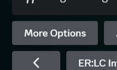

import apiWarning from '/snippets/apidocs.mdx';

<apiWarning/>

<AccordionGroup>
  <Accordion title="Player Logs" icon="people">
  To setup player logs (join/leave logs)
  1. Run the /config command
  2. Toggle to the ER:LC Integration tab
  3. Select which channel you want the logs to go to (second selection down)
  <Frame>
  
  </Frame>
  </Accordion>

  <Accordion title="Kill Logs" icon="skull">
  To setup kill logs 

  1. Run the /config command

  2. Toggle to the ER:LC Integration tab

  3. Select which channel you want the kill logs to go to (third selection down)

  <Frame>
  
  </Frame>
  </Accordion>

  <Accordion title="Mass RDM Detection" icon="people-group">
  To setup mass RDM

  1: Run the /config command

  2: Toggle to the ER:LC Integration tab

  3: Click the More Options button

  <Frame>
  
  </Frame>

  4: Choose which role(s) ERM will ping and which channel it will send the alert to

  <Frame>
  
  </Frame>

  5. Example of a log.

  <Frame>
  
  </Frame>
  

  
   
  </Accordion>
</AccordionGroup>
