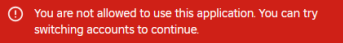

<Warning>
**Common Reasons for Remote Command Failure:**
- ❌ + 6️⃣ - Not linked
- ❌ + 7️⃣ - User not in server
- ❌ + 8️⃣ - Command failure
- ❌ + 🚫 - Bad format
</Warning>

# Remote Command Execution

## Syntax Examples:
- **Log a Punishment:**
  ```
  :log punish username action reason
  ```
- **Log a Punishment & Kick the User:**
  ```
  :log punish username action reason --kick
  ```
- **Log a Punishment & Ban the User:**
  ```
  :log punish username action reason --ban
  ```
- **Execute an Action In-Game:**
  ```
  :log actions execute name
  ```
- **Execute a Custom Command In-Game:**
  ```
  :log custom run name
  ```

## Setup
1. Run `/config`
2. Navigate to ER:LC Integration > Remote ERM Commands
3. Set the webhook channel to the channel where ER:LC Command Usage messages are sent.
4. To use Remote ERM Commands you need to link your Discord Profile with your Roblox profile via `/link` command. 

- For more information about Remote ERM Commands check [here](https://discord.com/channels/987798554972143728/988054766749888562/1236105462605418538).
 
- **If you encounter the issue shown below, it means your account is underage. Instead, you should utilize the legacy verification method in the command /link.**

<Frame>
  
</Frame>