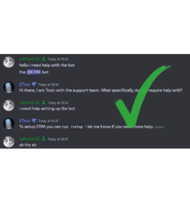
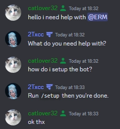

## Response Examples

When handling support threads you are expected to provide educated and accurate support at all times. Providing informative, vague or unhelpful responses does not help the user. You can review a few example interactions listed below to ensure each user is provided with informative support.
<Frame caption="Good Support Example">

</Frame>

<Frame caption="Bad Support Example">

</Frame>

If a support member isn’t able to provide accurate and informative support then they will be placed under a supervision program or returned back to Trial Support to re-do simulations and other necessary training programs. 

**We’re eager to help you, so let us. If you think you would benefit from extra training on how to deal with support threads, let us know. One of the management members or developers will happily help you.** 

## Non Compliant Users

When handling a support thread or engaging within the community you may approach a non compliant and disrespectful user. We ensure our community is frequently moderated so all trolls are promptly removed and only those who are willing to abide by our guidelines are within the server. 

**It’s vital to ensure you maintain a professional attitude when dealing with these types of individuals. Review the pointers below on how to handle it and how to resolve it efficiently.**

- **Be the bigger person:** Do not continue the situation and ensure it is handled swiftly. Do not engage in the behaviour as strict infractions will apply if you are caught doing so.
- **Moderate the user:** If you’ve provided them with a warning to refrain from being disrespectful or non compliant and they decide to continue, moderate them. Each support member has necessary moderation permissions.
- **State the guidelines and refuse to help:** If a user is being non compliant or directly disrespectful then you reserve the right to refuse to assist them further. You are simply permitted to leave the support thread and state you will not help them if they continue with that attitude.

Once you’ve moderated the user ensure to delete their messages if they contain any inappropriate content (if not auto-deleted by Circle already). We cannot stress this enough; engaging with the behaviour will make you just as bad which then leads to infractions and removal if appropriate.

## Patience and Understanding

It’s important to understand, not everyone understands ERM. When a user enters this server it is more than most likely they require support, therefore you are their first line of contact and you are expected to assist them. The user could be completely new to ERM and just need help setting it up and getting to know it more and you again are expected to help the user with this.

**It may be difficult to sit there for a long duration of time helping someone completely new to ERM, we get that. However, you are expected to remain respectful and helpful.**

- **Provide them with relevant documents:** If you believe the documentations will explain it easier, then refer them to that but ensure you do not overload them with information as that can be unhelpful in itself. 
- **Remain patient, respectful and helpful:** The user is relying on you to help them and you need to remain respectful even if they don’t get what you are saying. Ensure to ask for images where necessary and ensure to provide them with images if they understand it easier through that.
- **Ask for an invite:** If after a decent amount of time the user still doesn’t understand, ask for an invite and permissions to help them visually set it up. You MUST state they are NOT required to provide you with permissions, however it’s advised.

You aren’t alone and your fellow support members are behind you, whenever you require it. If you require assistance within the thread, then ask! We’re here to help and we will ensure the user leaves the thread with a full understanding no matter the situation.

## User Interactions

While handling interactions with both users and staff, you are to follow to guidelines below to ensure your interaction remains professional.

- **Use of their name:** Your support experience feel more personal providing a better interaction if you use their name. General interactions leads to less support requests and a negative experience.
- **Professionalism:** If you are unable to remain professional in your interaction, you are expected to remove yourself allowing for a different member of staff to take over.
- **Equality:** While you are working at ERM, you are equal to the staff next to you. This means, you are to remain friendly to your peers. This does not mean you are able to disregard your superiors.

At ERM, we value our interactions with our clients and between staff. 