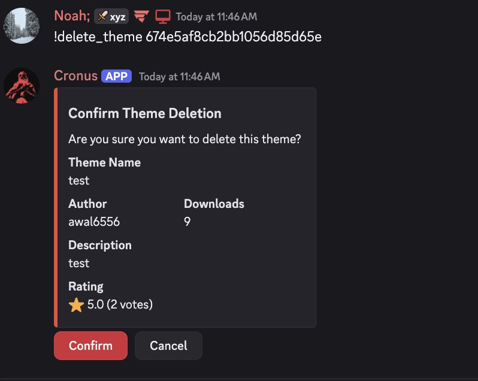
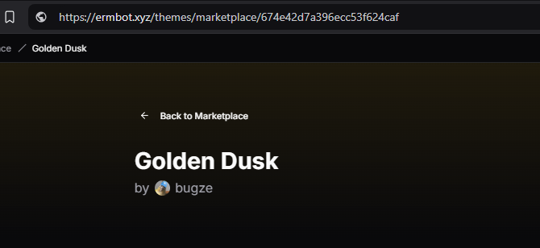
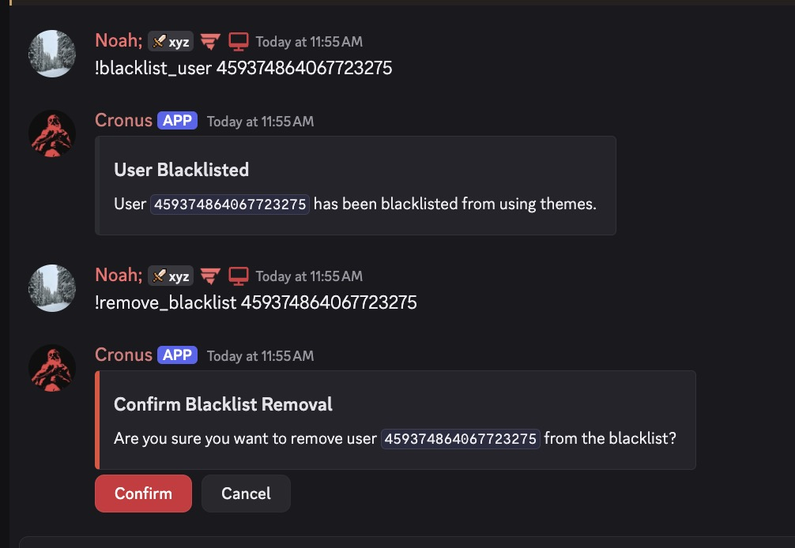

<Tip>The guidelines provided below are an example of what enforcement should be expected. It is at the discretion of the staff for experiences not displayed below that provide a negative experience.</Tip>

## Publisher's Policy
- Abusive or Destructive Behaviour
> Abusive and/or Destructive themes are outlined by the following;
> 1. Themes purposely imposing a risk to users visually, physically or mentally. I.E; epilepsy or other visual impairment.
> 2. Providing a negative experience towards the service. I.E; Harming the users experience and accessibility.
> 3. Purposely ensuring all colours of theme remain the same or extremely simular.
> 4. With malicious intent, attempt to and/or successfully bypassing site security measures.
-  No tolerance of spamming.
> While publishing themes to the service, you must respect the rate limits enforced provided to your user. Under no circumstances should a user attempt to bypass these published rate limits.
- Equality when handling reviews.
> Under no circumstances, should your coordinate or participate in the coordination of "raiding" or mass reviews of themes to negatively impact the score of the theme.`

<Warning>
ERM Staff, at any may request the removal, or forcefully removal of themes at its discretion.
</Warning>

## Removing Themes

Should a theme not follow the guidelines provided above, the following actions will be taken;
- You are to provide the user with a warning, and a reason as to why the theme is being removed.
- This to ensure the user is aware of the reason and can take the necessary steps to correct the issue.
- You are to issue this to the user's direct messages.
> Command usage would be as follows;
> - !delete_theme [Theme_ID](#finding-a-theme-id)
<Frame></Frame>

### Finding a Theme ID
To find a theme ID, you are to follow the steps below;
1. Navigate to the theme you wish to remove.
2. Locate the URL of the theme.
3. The theme ID is the last part of the URL. I.E; `https://ermbot.xyz/themes/marketplace/123456789`
<Frame></Frame>

### Extreme Cases
Should the user do any of the following, you are to ban them from creating themes;
- Attempt to bypass the rate limits.
- Attempt to bypass the security measures.
- Posting slurs or other inappropriate content within the theme.
- Posting offsite links to malicious or harmful content.
> Command usage would be as follows;
> - !blacklist_user User_ID
> - !remove_blacklist User_ID
<Frame></Frame>
